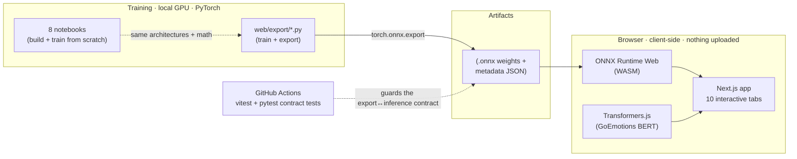

# Dive Deeper into Deep Learning

[](https://github.com/shiva-shivanibokka/Dive-Deeper-into-Deep-Learning/actions/workflows/ci.yml)
&nbsp;
&nbsp;
&nbsp;
&nbsp;

> ### Recruiter TL;DR
> - **What it is:** eight from-scratch PyTorch notebooks covering every major deep-learning architecture family (MLP → CNN → RNN/LSTM → Transformer → VAE/GAN → Diffusion → ViT → GNN), each also **playable in a live browser app** that runs the trained models client-side — no server, nothing uploaded.
> - **Hardest problem solved:** making training and browser inference *agree* — exporting PyTorch models to ONNX, reproducing every preprocessing step (MNIST center-of-mass centering, tokenization, standardization) exactly in TypeScript, and locking that contract down with automated tests so an export can't silently break a demo.
> - **Rigor:** a full debugging pass replaced "looks impressive" with "is defensible" — proper train/val/test splits (no test-set leakage), honest like-for-like comparisons, and a CI suite (vitest + pytest contract tests) that's green on GitHub Actions.

A hands-on, from-scratch tour of modern deep learning in **PyTorch** — eight self-contained notebooks that build every major architecture family from first principles, each with plain-language explanations and a "how to read this chart" guide for every visualization.

Every model is also **interactive in a companion web app** that runs entirely in your browser — no install, no server, nothing uploaded.

### ▶ [**Live demo → dive-deeper-deep-learning-shiv-a.vercel.app**](https://dive-deeper-deep-learning-shiv-a.vercel.app)

---

## The Notebooks

| # | Notebook | Architectures | Dataset |
|---|----------|---------------|---------|
| 01 | [Feedforward Networks](01_feedforward_networks.ipynb) | MLP, weight init, BatchNorm/Dropout, Autoencoder, anomaly detection | Adult Income, MNIST |
| 02 | [Convolutional Networks](02_convolutional_networks.ipynb) | CNN from scratch, Grad-CAM, transfer learning (ResNet-18) | CIFAR-10 |
| 03 | [Sequence Models](03_sequence_models.ipynb) | RNN, LSTM, GRU, BiLSTM, additive attention, gradient clipping | 20 Newsgroups |
| 04 | [Attention & Transformers](04_attention_transformers.ipynb) | Scaled dot-product & multi-head attention, positional encoding, encoder–decoder, DistilBERT fine-tuning | 20 Newsgroups |
| 05 | [Generative Models](05_generative_models.ipynb) | VAE, DCGAN, WGAN, conditional VAE, FID proxy | MNIST |
| 06 | [Diffusion Models](06_diffusion_models.ipynb) | DDPM from scratch, noise schedule, denoising U-Net | MNIST |
| 07 | [Vision Transformer](07_vision_transformer.ipynb) | ViT from scratch, patch embedding, attention maps | Fashion-MNIST |
| 08 | [Graph Neural Networks](08_graph_neural_networks.ipynb) | GCN, message passing, node classification | Cora |

They're ordered by **data shape** — flat vectors → grids → sequences → generation → graphs — so each notebook builds on the last.

---

## What Makes These Different

- **From scratch, then production.** Notebook 02 builds a CNN by hand *and* fine-tunes a pretrained ResNet. Notebook 04 implements attention from the equations *and* fine-tunes DistilBERT. You see both the mechanism and the real-world tool.
- **Honest evaluation.** Proper train/validation/test splits with the scaler/vocabulary fit on training data only, early stopping on a held-out validation set (never the test set), and like-for-like comparisons on identical held-out data. Deliberate simplifications (e.g. a pixel-space FID proxy) are labelled as such.
- **Every chart is explained.** No unlabeled plots — each visualization has a dedicated "How to Read This Chart" section.
- **Cross-notebook throughlines.** Grad-CAM (nb 02) and ViT attention maps (nb 07) answer the same "where is the model looking?" question two ways. VAEs/GANs (nb 05) and Diffusion (nb 06) are compared head-to-head. The GNN (nb 08) is benchmarked against the MLP (nb 01).

---

## Architecture

The core design decision is **client-side inference**: each notebook trains a network in PyTorch and exports it to the portable [ONNX](https://onnx.ai/) format; the browser then runs those files directly with [ONNX Runtime Web](https://onnxruntime.ai/docs/tutorials/web/) (WebAssembly) and [Transformers.js](https://huggingface.co/docs/transformers.js) for the language model. Your drawings and text never leave your machine — there is no backend, no per-request cost, and the demo works offline once loaded.



**Why this shape, and the tradeoff:** ONNX is the bridge that lets a Python-trained model run in a JavaScript runtime, so the notebooks and the app never need to share a language or a server. The cost is that *every* preprocessing step has to be re-implemented identically on the browser side (image scaling/centering, tokenization, feature standardization) — a silent mismatch there produces a model that loads fine but predicts garbage. The `tests/` contract suite exists specifically to make that failure mode loud instead of silent.

---

## Results

Representative held-out numbers from the executed notebooks (your run may vary slightly by hardware):

| Task | Model | Held-out score |
|------|-------|----------------|
| Income > $50K (Adult) | MLP vs XGBoost | 84.6% vs **86.6%** acc |
| CIFAR-10 | CNN from scratch vs fine-tuned ResNet-18 | 79.0% vs **96.1%** val acc |
| 20 Newsgroups (hockey vs sci.med) | RNN / LSTM / GRU / BiLSTM / **BiLSTM+Attention** | 76% / 88% / 86% / 88% / **91%** |
| 20 Newsgroups | Scratch Transformer vs **DistilBERT** (500 labels) | 85.9% vs **95.2%** val acc |
| Cora | GCN node classification | **81%** test acc (from 140 labels) |

The transfer-learning wins (ResNet, DistilBERT) are the headline: a pretrained backbone beats a from-scratch model **with a fraction of the data**.

---

## Interactive Web Demo

**Live:** https://dive-deeper-deep-learning-shiv-a.vercel.app

Ten interactive tabs, each running a real trained model in your browser:

| Tab | What you do | Model |
|-----|-------------|-------|
| **Tabular MLP** | Move sliders; watch P(income > $50K) update live | Feedforward net (nb 01) |
| **Autoencoder** | Draw a digit; see it compressed & rebuilt, with an anomaly score | 16-dim bottleneck AE (nb 01) |
| **MNIST CNN** | Draw a digit; get per-class probabilities | CNN (nb 02) |
| **LSTM Text** | Type a sentence; it picks one of 6 topics | BiLSTM (nb 03) |
| **Transformer (BERT)** | Type text; see 28 fine-grained emotions | DistilBERT / GoEmotions* |
| **VAE Generator** | Drag a 2-D latent point; morph one digit into another | VAE decoder (nb 05) |
| **GAN Generator** | Sample random noise into fresh digits | DCGAN generator (nb 05) |
| **Diffusion (DDPM)** | Step from pure noise to a digit | Denoising U-Net, cosine schedule (nb 06) |
| **Vision Transformer** | Pick an image; toggle the patch grid; read predictions | ViT (nb 07) |
| **Graph Net (GCN)** | Hover a paper to identify it; click to light up citations | GCN on Cora (nb 08) |

\* **BERT tab provenance:** Notebook 04 fine-tunes DistilBERT on the 20-Newsgroups text. The web tab instead serves a separate, pretrained **[GoEmotions](https://github.com/google-research/google-research/tree/master/goemotions)** classifier (a DistilBERT distilled on Google's 28-emotion taxonomy), exported to ONNX and self-hosted so it always loads. It demonstrates the same architecture on a richer, more fun task — it is not the notebook's own weights.

```bash
cd web
npm install
npm run dev
```

---

## Skills Demonstrated

*The same true facts as above, phrased for a skim-reading recruiter / ATS scan.*

- **Deep learning across modalities** — vision, language, generative, and graph models, implemented **from first principles** and via **transfer learning / fine-tuning** (ResNet-18, DistilBERT).
- **Client-side ML model serving / MLOps** — a training → **ONNX export** → in-browser serving pipeline, with model code cleanly separated from the notebooks.
- **CI/CD pipeline implementation** — GitHub Actions running build, lint, and two test suites on every push/PR.
- **Automated testing** — `vitest` unit tests for preprocessing logic and `pytest` **contract tests** that assert the exported models still match what the app feeds them.
- **Cloud deployment** — deployed and continuously served on **Vercel**.
- **System design & architecture** — documented the client-side-inference tradeoff and the export↔inference contract, and hardened it through a real debugging pass.
- **Model optimization & portability** — ONNX graph export (opset/dynamic axes), int8 quantization for the served language model, WebAssembly inference.

---

## Tests & CI

GitHub Actions runs on every push/PR ([`.github/workflows/ci.yml`](.github/workflows/ci.yml)):
- **Web** — Next.js build, ESLint, and `vitest` unit tests for the pure preprocessing (softmax, LSTM tokenization, MNIST center-of-mass placement).
- **Model contracts** — `pytest` loads every exported `.onnx` and asserts its input/output names, dtypes, and shapes still match what the app feeds it, plus JSON-metadata consistency (LSTM `maxlen`/labels, VAE/GAN latent dims, diffusion schedule). This is what stops an export drift from silently breaking a demo.

```bash
cd web && npm test        # frontend unit tests
pytest tests/             # ONNX contract tests (pip install onnxruntime numpy pytest)
```

---

## Quickstart (notebooks)

```bash
# 1. (Recommended) install a CUDA-matched PyTorch first if you have a GPU:
#    pip install torch torchvision --index-url https://download.pytorch.org/whl/cu124
# 2. Install everything else:
pip install -r requirements.txt
# 3. Launch:
jupyter notebook
```

Datasets download automatically on first run (into `data/`, git-ignored). A GPU is recommended for notebooks 02, 04, 05, 06, and 07 but not required.

To regenerate the browser models from scratch (trains + exports to `web/public/models/`):

```bash
python web/export/export_mnist_demos.py   # CNN, autoencoder, VAE, GAN
python web/export/export_lstm.py          # 6-topic BiLSTM
python web/export/export_diffusion.py     # DDPM U-Net (cosine schedule)
python web/export/export_vit.py           # Vision Transformer
python web/export/export_tabular.py       # tabular MLP
python web/export/export_gnn.py           # GCN (precomputed embeddings)
```

---

## Repository Structure

```
.
├── 01_feedforward_networks.ipynb   ... 08_graph_neural_networks.ipynb   # the 8 notebooks
├── requirements.txt                # Python dependencies
├── tests/                          # pytest ONNX <-> app contract tests
├── .github/workflows/ci.yml        # CI: web build/lint/tests + model contracts
├── web/                            # Next.js interactive demo (deployed to Vercel)
│   ├── app/                        # tabs + lib/ (ONNX glue, tested preprocessing)
│   ├── export/                     # scripts that train + export each model to ONNX
│   └── public/models/              # exported .onnx weights + metadata
└── data/                           # datasets (auto-downloaded, git-ignored)
```

---

## Tech Stack

**Modeling:** PyTorch 2.6 · torchvision · PyTorch Geometric · Hugging Face Transformers · scikit-learn · XGBoost
**Serving:** ONNX · ONNX Runtime Web · Transformers.js · Next.js 15 · React 19 · Vercel
**Tooling:** vitest · pytest · ESLint · GitHub Actions

---

## Roadmap / Known Limitations

- The **browser models are deliberately small** so they load fast and run on a laptop with no GPU — their accuracy sits below a full training run, which is disclosed on each tab. The full-scale results live in the notebooks.
- The **FID in Notebook 05 is a pixel-space proxy**, not true Inception-based FID — it's labelled as such and used only for relative comparison.
- Notebook execution is **not run in CI** (hours + GPU); CI lints notebooks and tests the exported artifacts instead. Full notebook runs stay a local/GPU job.

---

*Author: Shivani Bokka*
